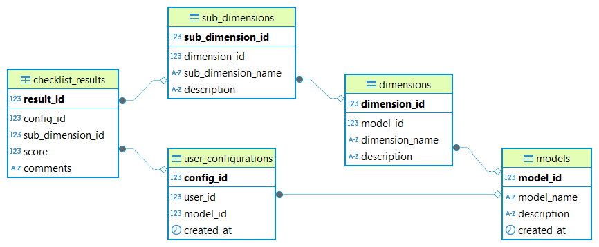

# Классификатор моделей зрелости

## Описание проекта

Данный проект представляет собой прототип системы классификатора моделей зрелости, реализованный на базе PostgreSQL. Система предназначена для:

- Хранения и управления различными моделями зрелости.
- Создания пользовательских конфигураций для самооценки.
- Генерации чек-листов для оценки уровня зрелости.
- Анализа результатов и выдачи рекомендаций для улучшения.

Система ориентирована на использование компаниями для оценки своей зрелости в различных аспектах, таких как стратегия, технологии и управление рисками.

---

## Назначение базы данных

База данных используется для:

1. Хранения данных о моделях зрелости:

   - Модели зрелости включают измерения, подизмерения и критерии оценки.
   - Каждое измерение может включать несколько подизмерений, для которых определены критерии оценки с рекомендациями.

2. Создания пользовательских конфигураций:

   - Пользователь выбирает модель зрелости и настраивает её под свои нужды.

3. Генерации и сохранения результатов самооценки:

   - Результаты самооценки сохраняются для дальнейшего анализа.

4. Анализа данных и выдачи рекомендаций:
   - Система анализирует результаты самооценки и предлагает конкретные шаги для улучшения.

---

## Структура проекта

Проект состоит из следующих файлов и скриптов:

1. `./init-scripts/` — папка со скриптами SQL
   - `00_drop_all.sql` — скрипт для удаления всех таблиц и функций.
   - `01_create_tables.sql` — создание структуры базы данных.
   - `02_insert_test_data.sql` — наполнение базы данных тестовыми данными.
   - `03_create_functions.sql` — создание хранимых функций.
   - `04_test_scenarios.sql` — тестовые сценарии для проверки системы.
2. `./diagrams/` — папка с ER-диаграммами базы
3. `./dumps/` — папка с дампами базы
4. `./template_queries.sql` — шаблон запросов для работы с базой.
5. `docker-compose.yml` — конфигурация для запуска базы данных в Docker.
6. `README.md` — документация проекта.

---

## ER-диаграмма базы данных



Диаграмма отражает структуру базы данных, включая связи между таблицами (`models`, `dimensions`, `sub_dimensions`, `criteria`, `user_configurations`, `checklist_results`).

---

## Требования

Для работы с проектом необходимы:

- PostgreSQL версии 14 или выше.
- Клиент для работы с SQL (pgAdmin, psql, DBeaver и др.).
- Docker и Docker Compose (опционально).

---

## Установка и настройка

**_Два варианта._**

Первый подразумевает под собой установку Docker, для того, чтобы автоматизировать создание базы скриптом без установки требований выше. Все поставляется в контейнере сразу, ничего кроме докера не надо.

Второй подразумевает под собой установку СУБД PostgreSQL (при желании можно установить также клиент, чтобы не работать из терминала).

### Вариант 1: Запуск через Docker

1. Убедитесь, что Docker и Docker Compose установлены.
2. Склонируйте репозиторий проекта.
3. Выполните команду для запуска базы данных:
   ```bash
   docker-compose up
   ```
4. После запуска база данных будет доступна по следующим параметрам:
   - Хост: localhost
   - Порт: 5432
   - Имя базы данных: maturity_classifier
   - Пользователь: admin
   - Пароль: secret

### Вариант 2: Восстановление из дампа

1. Создайте новую базу данных:
   ```sql
   CREATE DATABASE maturity_classifier;
   ```
2. Восстановите базу данных из дампа:
   ```bash
   psql -U <username> -d maturity_classifier -f maturity_classifier_dump.sql
   ```

---

## Тестирование

После настройки базы данных выполните тестовые сценарии:

1. Получение списка моделей зрелости:

   ```sql
   SELECT * FROM get_models();
   ```

2. Генерация чек-листа:
   ```sql
   SELECT * FROM generate_checklist(1);
   ```
3. Сохранение результатов самооценки:

   ```sql
   SELECT save_checklist_result(1, 1, 4, 'Хороший прогресс в управлении портфелем');
   ```

4. Анализ результатов:
   ```sql
   SELECT * FROM analyze_results(1);
   ```
5. Получение рекомендаций:
   ```sql
   SELECT * FROM get_recommendations(1);
   ```

## Инструкция к запуску проекта в vs code

1. Запустить контейнер fr-maturity_classifier в Docker (или run services в vs code)

2. Очистить БД и пересобрать контейнер для коррекного запуска скрипта init.sql
Вариант 1: в терминале запустить 2 команды.
   ```bash
   docker-compose down -v
   docker-compose up --build
   ```
Вариант 2: двойным щелчком запустить файл rebuild.bat
Вариант 3: в терминале .\rebuild.bat

3. Протестировать backend 
   http://localhost:8000/docs 
---
